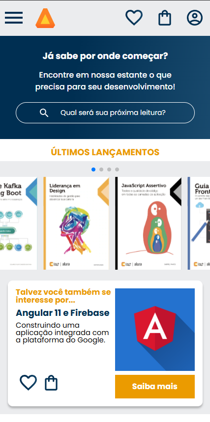

<h1 align="center"> AluraBooks </h1>

Programa exclusivo e gratuito, promovido pela Alura para ensino de desenvolvimento WEB.  
<a href="https://cursos.alura.com.br/course/html-css-responsividade-mobile-first">Acesse o curso completo clicando aqui.</a>

  <a href="#-tecnologias">Tecnologias</a>&nbsp;&nbsp;&nbsp;|&nbsp;&nbsp;&nbsp;
  <a href="#-projeto">Projeto</a>&nbsp;&nbsp;&nbsp;|&nbsp;&nbsp;&nbsp;
  <a href="#-layout">Layout</a>&nbsp;&nbsp;&nbsp;|&nbsp;&nbsp;&nbsp;
  <a href="#-licença">Licença</a>

  

 

  

## 🚀 Tecnologias

Esse projeto foi desenvolvido com as seguintes tecnologias:

- HTML e CSS
- Git e Github
- Figma

## 💻 Projeto

O AluraBooks é uma página fictícia criada pela Alura através de um curso HTML e CSS com foco em responsividade e metodologia mobile first. 

- [Acesse o projeto finalizado, online](https://github.com/AmoN-RMS/alura-books)

- [Assistir aulas](https://cursos.alura.com.br/course/html-css-responsividade-mobile-first)

## 🔖 Layout

Você pode visualizar o layout do projeto através [DESSE LINK](https://www.figma.com/community/file/1410386210865694868). É necessário ter conta no [Figma](https://figma.com) para acessá-lo.

## 📝 Licença

Esse projeto está sob a licença MIT.

---

Feito com ♥ by Amon & Alura 👋 [Participe da nossa comunidade!](https://discord.com/invite/QeBdgAjXnn)